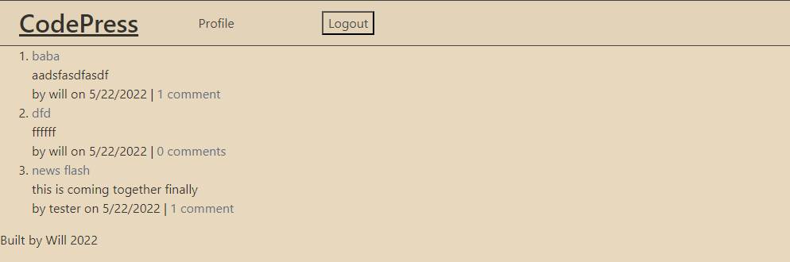

# **CodePress**

## **Description**
CodePress is a tech blog website where developers can publish blog posts and interact with other developers' posts.

## **Table of Contents**

- [Installation](#installation)
- [Usage](#usage)
- [Screenshots](#screenshots)
- [Testing](#testing)
- [Questions](#questions)

## **Installation**

To use my website, simply head over to [the CodePress site here](https://blooming-falls-43636.herokuapp.com/) and begin sharing your thoughts on coding! After logging in you can post anything you have to say and interact with other user's posts on the website!

## **Usage**

To use most of the features on the site you will need to sign up with a new account.  After doing so you can share your thoughts to your hearts content and let others know what you think about their posts!  It's a great way to interact with other developers

## **Screenshots**

## **Testing**

Try creating a post or commenting on someone else's!  After creating a post you can view it to edit it or delete it if it's yours.

## **Questions**

Reach out to me if you have any questions!  [I can be found here.](https://github.com/wbruns)